# Automated Legacy Migration Agent

The Automated Legacy Migration Agent is a human-gated, three-agent capstone
that turns a bounded legacy source slice into an isolated, reviewable migration
candidate. It supports two modernization paths:

- Salesforce Visualforce and Apex to an additive Lightning Web Component (LWC)
  and Apex solution; and
- Mule 3 to a separate Mule 4 application using DataWeave 2 and MUnit.

The project is an **agentified migration harness**, not a collection of
deterministic conversion scripts. Architect, Engineer, and Validator are real
LLM roles defined in executable Markdown. The same Architect supports a
free-form conversational intake operation and a separate manifest-planning
operation. A deterministic Python/LangGraph controller supplies the authority
boundary around them: typed contracts, dependency analysis, curated knowledge
retrieval, human approvals, isolated file application, independent validation,
evidence, and durable pause/resume.

This README is the authoritative technical and submission reference. Markdown
under `agents/` and `knowledge/wiki/` remains because it is runtime input, not
duplicate narrative documentation.

## Contents

- [Scope and current evidence](#scope-and-current-evidence)
- [Quick start and primary UI](#quick-start-and-primary-ui)
- [Architecture and workflow](#architecture-and-workflow)
- [Reasoning design](#reasoning-design)
- [Agentic LLM Wiki and dependency graph](#agentic-llm-wiki-and-dependency-graph)
- [Contracts, state, and evidence](#contracts-state-and-evidence)
- [Fixtures, test references, and generated output](#fixtures-test-references-and-generated-output)
- [Salesforce slice](#salesforce-slice)
- [MuleSoft slice](#mulesoft-slice)
- [Qwen and model-provider boundary](#qwen-and-model-provider-boundary)
- [Safety and authority](#safety-and-authority)
- [CLI, configuration, and testing](#cli-configuration-and-testing)
- [Evaluation protocol and results](#evaluation-protocol-and-results)
- [Presentation walkthrough](#presentation-walkthrough)
- [Project layout](#project-layout)
- [Course deliverable traceability](#course-deliverable-traceability)
- [Limitations and next evidence](#limitations-and-next-evidence)
- [Security, attribution, and license](#security-attribution-and-license)

## Scope and current evidence

The intended user is a developer or technical lead who wants to analyze a
small legacy slice, review a proposed migration plan, generate an additive
candidate, and inspect evidence before any external action. The supported
fixtures are synthetic and contain no customer data.

The application may read one controller-selected fixture, build a dependency
graph, retrieve Wiki guidance, invoke the three model roles, pause for exact
human decisions, write approved content to a disposable workspace, run local
controller-owned checks, and retain sanitized local evidence.

It does **not** edit the legacy source, commit or push Git changes, open a pull
request, connect to a Salesforce org, deploy metadata, call Anypoint, start a
Mule runtime, publish an artifact, or claim production readiness.

### Verified local snapshot

The following snapshot was verified locally on 2026-08-26. Counts describe this
exact source tree and must be regenerated after code changes.

| Evidence | Verified result | Claim boundary |
|---|---:|---|
| Full Python repository suite | **953 passed** | Controller, policies, adapters, UI, and test doubles; not model quality or platform execution |
| Ruff formatting/lint and strict mypy | Passed | Python source quality and typing only |
| Reference-candidate LWC Jest | **10/10 passed** | Retained fixture tests; not evidence of a Qwen-generated run |
| Controller-owned Jest against reference candidate | **12/12 passed** | Independent browser behavior checks; not Apex or org validation |
| Public contracts | 52 exact versioned JSON Schemas | Local contract compatibility only |
| Agent registry | Exactly 3 valid definitions | Architect, Engineer, and Validator only |
| Formal evaluation | 72/72 cells `not_performed` | No comparative quality, latency, token, or cost result exists |
| Bounded pilot | 2/4 cells measured and succeeded | Controller-owned static fixture checks only; both Qwen cells remain `not_performed` |
| Salesforce org execution | Not performed | No Apex compile/test or terminal org job is claimed |
| Mule runtime execution | Unavailable by design | Runtime authority is disabled; no Maven/MUnit pass is claimed |

Qwen3.8 is installed for the local interaction path. The Ollama adapter, UI,
structured-output boundary, and controlled failures are exercised by the test
suite. An interactive run is evidence only for that run and is not
automatically a formal evaluation result.

## Quick start and primary UI

### Prerequisites

- Python 3.12 (the package supports 3.11–3.13);
- [`uv`](https://docs.astral.sh/uv/) and the checked-in `uv.lock`;
- Node.js 22 and npm for LWC Jest; and
- [Ollama](https://ollama.com/) with `qwen3.8:latest`.

Install the locked development environment and controller-owned Jest toolchain:

```bash
uv sync --frozen --extra dev
(cd tooling/lwc-jest && npm ci --ignore-scripts)
```

Pull or confirm the selected local model:

```bash
ollama pull qwen3.8:latest
ollama list
```

Validate the executable agent definitions, then start the application:

```bash
uv run --frozen legacy-migration-agent agents-check --project-root .
uv run --frozen legacy-migration-agent ui \
  --project-root . \
  --ollama-model qwen3.8:latest \
  --open-browser
```

The server listens on `http://127.0.0.1:8765/`. If Ollama is not already
running, start `ollama serve` in a separate terminal.

### Terminal lifecycle logging

The UI server writes concise lifecycle events to stderr by default. They make
the active boundary visible without exposing prompts, private model output,
generated source, diffs, command output, credentials, reviewer comments, or
filesystem paths. A normal run includes output similar to:

```text
15:32:04 INFO    event=ui.provider.configured provider="ollama" model_id="qwen3.8:latest" execution_boundary="local_loopback" timeout_seconds=180.0
15:32:11 INFO    event=ui.conversation.model.started conversation_id="…" exchange=1 platform="salesforce"
15:32:11 INFO    event=model.call.started role="architect" provider="ollama" output_contract="ArchitectConversationReply"
15:32:11 INFO    event=ollama.inventory.started phase="before_generation"
15:32:11 INFO    event=ollama.inventory.completed phase="before_generation" elapsed_ms=18
15:32:11 INFO    event=ollama.generation.started
15:32:39 INFO    event=ollama.generation.completed elapsed_ms=27842
15:32:40 INFO    event=model.call.completed role="architect" elapsed_ms=28631
15:32:40 INFO    event=ui.conversation.model.completed conversation_id="…" exchange=1 readiness="ready_to_launch"
15:32:45 INFO    event=ui.conversation.launch.started conversation_id="…" platform="salesforce"
15:32:45 INFO    event=model.call.started role="architect" provider="ollama" output_contract="ArchitectManifestProposal"
15:33:14 INFO    event=ui.manifest.awaiting_approval handle="…" workflow_status="awaiting_approval" disposition=null attempt=1
```

`ui.provider.configured` means the server accepted the fixed local provider
configuration; it does not claim Ollama is connected. The first successful
`ollama.inventory.completed` event confirms that the role call reached Ollama
and verified the configured model alias. Failures use stable fields such as
`seam`, `category`, `reason_code`, and `public_code`, never raw exception text
or a traceback. These events expose lifecycle checkpoints, not private
chain-of-thought.

### Conversation flow

1. Type a normal free-form message to the Architect. The Salesforce and
   MuleSoft buttons are optional examples, not the only messages the UI accepts.
2. Continue the Qwen conversation across multiple messages. Architect v3 uses
   its typed intake operation to ask for missing details or return a refined
   request; this advisory exchange does not create a migration run.
3. Select **Salesforce: Visualforce to LWC** or **MuleSoft: Mule 3 to Mule 4**.
   The controller owns this target selection; the model cannot infer or change
   it. Send another message after changing the selection so the current exchange
   is bound to that target.
4. When the latest typed reply is ready, choose **Start migration**. That
   explicit action freezes the latest refined request and selected platform into
   one immutable run.
5. Architect's manifest operation analyzes the fixture, dependency graph, scope
   policy, and Wiki trace, then returns one typed manifest proposal.
6. Review exact paths, transformations, checks, risks, and unresolved questions.
   The UI exposes approve or reject; the lower-level CLI also supports a
   modification-request decision.
7. Approval invokes Engineer. It returns complete content only for approved
   paths; the controller applies that content in isolation.
8. The controller derives the actual disk diff, runs validation, and invokes
   Validator with an immutable evidence bundle.
9. Review the conversation, harness timeline, receipts, generated files,
   per-file unified diff, model identity/revision, and candidate ZIP.
10. Use **Save candidate to output/** to materialize the exact persisted file
   plan under an ignored, attempt-specific directory for local inspection.
11. An eligible Engineer-actionable failure may offer one separately approved
   corrective attempt. There is no third attempt.

The composer accepts messages from 1 to 2000 characters. One conversation is
bounded to 12 user/Architect exchanges. Contextual follow-ups such as “also add
tests” are therefore preserved within that conversation. Architect marks the
request ready only when the chosen target and requested outcome are concrete;
the refined request frozen at launch is between 10 and 1000 characters.

**New chat** is always visible and is temporarily disabled only while an
HTTP/model action is actively in progress. It creates a separate blank
conversation and detaches the browser from the currently displayed run. It does
not approve, reject, cancel, delete, or otherwise decide that run: an
approval-pending run remains durably pending. Natural-language messages likewise
never count as manifest approval or correction authority.

Refreshing the browser restores the current valid conversation or run selected
by that browser. Public conversation exchanges are append-only under
`.runs/agent-ui/conversations/<conversation-id>/`; immutable migration runs are
stored separately under `.runs/agent-ui/<handle>/`. Both locations are ignored
by Git. The transcript contains the public typed user/Architect messages and
harness summaries, not raw token streams or private chain-of-thought. Downloading
a ZIP does not apply it to the source fixture.

Saving a candidate creates
`output/<platform>-<handle>/attempt-<n>/candidate/`, a deterministic
`candidate.zip`, and an `export.json` receipt. The receipt records the
authoritative local validation disposition. A saved candidate is not silently
relabelled as accepted or production-ready: `recoverable_failure` and
`environment_unavailable` exports remain debugging/review artifacts, while
`ready_for_human_review` still requires the separate final-review and external
platform gates. `output/` is ignored by Git, and the fixed UI scenarios never
use it as model input.

### Controller-owned UI configuration

| Setting | Value and boundary |
|---|---|
| UI host and default port | `127.0.0.1:8765`; operator may choose another unprivileged port |
| Ollama endpoint | Fixed to `127.0.0.1:11434`; browser cannot override it |
| Model alias | Required at server startup; browser cannot change it |
| Role timeout | 180 seconds by default; operator range 1–600 seconds |
| Conversation bounds | 12 user/Architect exchanges per conversation; at most 64 persisted conversations |
| Source | One of two fixed synthetic fixtures |
| Writable paths | Fixed by platform policy and the approved manifest |
| Validation | Stable controller command IDs, never model or browser text |

For a slower local model, pass `--ollama-timeout-seconds 600`.

### Loopback API surface

The browser uses a fixed same-origin JSON API with a server-issued CSRF token.
The browser cannot supply an Ollama endpoint, model alias, fixture path, command,
or writable path.

| Route | Purpose and authority |
|---|---|
| `GET /api/readiness` | Report sanitized server-owned provider, reachability, and model-installation readiness; never invokes a role |
| `POST /api/conversations` | Create an append-only public intake conversation; does not create a run |
| `GET /api/conversations/<id>` | Reload its verified public messages, readiness, model-call receipts, and optional launch handle |
| `POST /api/conversations/<id>/messages` | Append one user message and one typed Architect intake reply; cannot authorize work |
| `POST /api/conversations/<id>/launch` | Freeze the latest ready refined request and controller-selected platform, then create exactly one migration run |
| `POST /api/sessions` | Lower-level direct run creation retained for compatibility; the primary UI uses explicit conversation launch |
| `GET /api/sessions/<handle>` and `GET /api/sessions/latest` | Read a verified run projection or recover the latest run |
| `POST /api/sessions/<handle>/{decision,retry,export}` | Record an exact human decision, authorize the bounded correction, or export the persisted candidate |
| `GET /api/sessions/<handle>/candidate.zip` | Download the isolated candidate; never apply or deploy it |

### Interpreting stopped runs

| Visible state | Meaning |
|---|---|
| Awaiting approval | Architect finished and the controller paused as designed |
| Structured-output failure | A role response failed schema or policy validation; no success is claimed |
| Candidate contract failure | Generated files violated exact scope, syntax, safety, or behavior requirements |
| Generated Jest failure | The candidate-authored implementation/test pair failed its own suite |
| Controller Jest failure | The candidate failed the independent LWC behavior contract |
| MuleSoft MUnit unavailable | Expected with the checked-in disabled runtime authority |
| Terminal failure | The fail-closed lifecycle ended without a verified candidate; source and external systems remain unchanged |

## Architecture and workflow

The runtime has exactly three LLM roles. Their Markdown definitions contain
validated YAML metadata, permissions, input/output contracts, and role prompts.

| Role | Definition | Responsibility | Explicit boundary |
|---|---|---|---|
| Architect | `agents/architect.md` (`architect/v3`) | Return `ArchitectConversationReply` during intake, then analyze frozen evidence and propose one `ArchitectManifestProposal` after explicit launch | Read-only; cannot select the platform, create a run, write, execute, approve, or widen scope |
| Engineer | `agents/engineer.md` (`engineer/v11`) | Return a complete typed file plan for approved paths or an intervention | No direct filesystem/command access; cannot alter the manifest or declare success |
| Validator | `agents/validator.md` (`validator/v1`) | Critique an immutable evidence bundle and return `ValidatorAdvisory` | Cannot execute checks, edit files, approve a gate, or override disposition |

The Python/LangGraph controller is **not a fourth agent**. It owns source
fingerprints, graph and Wiki construction, strict parsing, policies, exact
approvals, workspace application, disk-derived change sets, validation
adapters, terminal disposition, redaction, evidence, and checkpoints.

The diagram shows the authority-bearing workflow after explicit launch; the
text flow immediately below includes the preceding advisory intake.



```text
free-form public messages + controller-selected platform
        |
        v
ArchitectConversationReply (clarify or refine)
        |
        v
explicit Start migration
        |
        v
frozen refined request + frozen source revision
        |
        v
dependency graph + Wiki RetrievalTrace
        |
        v
ArchitectManifestProposal
        |
        v
human decision -------- reject/modify -------> controlled stop
        |
      approve
        v
EngineerModelOutcome
        |
        v
isolated application -> disk-derived ChangeSet
        |
        v
controller receipts -> ValidationReport
        |
        v
ValidatorAdvisory
        |
        +---- eligible failure -> approved attempt 2
        |
        v
final independent human review
```

The main implementation layers are:

| Layer | Package | Responsibility |
|---|---|---|
| Application | `application/` | Supported scenarios, run lifecycle, final review, governed knowledge |
| Agent runtime | `agent_runtime/` | Definitions, role adapters, model clients, correction, checkpoints |
| Core | `core/` | Integrity, policies, scope, workspace, safe execution, redaction, session |
| Graph and knowledge | `graphs/`, `knowledge/` | Platform dependency graphs, evaluation/storage, Wiki retrieval/governance |
| Platforms | `platforms/` | Salesforce/MuleSoft policies, checks, and evidence parsers |
| Interaction | `ui/`, `cli.py` | Loopback conversation, evidence/diff views, CLI lifecycle |

The editable Mermaid source and portable rendering for this system view remain
under `docs/diagrams/` as a README asset.

## Reasoning design

The system uses a bounded, ReAct-inspired sequence: observe frozen evidence,
propose one constraint-complete plan, obtain approval, act in isolation,
validate, and reflect.

Tree of Thought was considered and intentionally rejected. These migrations
are constrained by exact paths, hard platform rules, provenance, and human
authority. Parallel speculative branches would increase cost while making
scope, approval, and evidence lineage ambiguous.

Architect therefore produces one auditable plan. A plan-invalid or unresolved
result stops for a person and requires a new planning cycle. After approval,
one Engineer-actionable failure may receive one separately approved,
same-manifest correction. There is no beam search, branch voting, hidden
alternative execution, or attempt three.

Human decisions are distinct:

1. manifest approve/reject/modify (the UI exposes approve/reject; the CLI also
   supports modify);
2. optional exact correction approval; and
3. final accept/reject/request-changes review through the provider-free CLI
   lifecycle. Final review is not currently an in-browser control.

Each decision binds the run, thread, request, revision, action, interrupt, and
artifact digest. The **Human reviewer ID** field is declarative, unauthenticated
local audit metadata supplied by the person using the UI. It is not another
agent, account authentication, or an enterprise identity assertion.

## Agentic LLM Wiki and dependency graph

The project uses a curated Agentic LLM Wiki instead of unrestricted vector RAG.
The corpus is small, version-sensitive, and safety-sensitive, so deterministic,
reviewable retrieval is preferable to unbounded similarity search.

`knowledge/wiki/` contains Salesforce, MuleSoft, validation, safety, and
reasoning pages. The catalog gives each page a stable ID, platform/runtime
scope, review state, source-authority metadata, related pages, and digest.
Retrieval validates the inventory, filters by platform/version/date, performs
deterministic lexical ranking, optionally expands curated links, and records
the exact result in `RetrievalTrace`. Catalog, page, digest, or generated-index
drift fails closed. Promotion and invalidation require separate typed review
records; a model cannot make its own output trusted knowledge.

The shipped migration presets select one primary page and then traverse only
version-compatible catalog links. The Salesforce slice retrieves the
Visualforce-to-LWC page plus its Apex-security and validation pages; the
MuleSoft slice retrieves the Mule 3-to-4 semantics page plus its exact target
toolchain and validation page. All checked-in pages remain `pilot` guidance;
the ReAct page is explicitly research inspiration rather than a standard.

The dependency graph represents **repository facts** and is bound to source
bytes:

- Salesforce: Visualforce/Apex references, Apex tests, permissions, schema and
  metadata references, LWC/Apex relationships, and dynamic constructs.
- MuleSoft: flows, subflows, configurations, property references, DataWeave
  modules, API contracts, and MUnit relationships.

The Wiki may explain how a relationship should be migrated; it cannot erase an
unresolved graph edge. This separation prevents generic advice from being
mistaken for source evidence.

## Contracts, state, and evidence

Public handoffs are strict Pydantic models with unknown-field rejection and
bounded paths, strings, collections, and bytes. The frozen version 1.0 inventory
contains 52 exact schemas in `schemas/v1.0/`.

| Stage | Primary contracts |
|---|---|
| Conversation intake | `ArchitectConversationContext`, `ArchitectConversationReply`, `ArchitectConversationView` |
| Request/plan | `MigrationRequest`, `ArchitectManifestProposal`, `MigrationManifest`, `ManifestApproval` |
| Implementation | `EngineerModelOutcome`, `ImplementationIntervention`, `ChangeSet` |
| Validation | `ToolReceipt`, `ValidationReport`, `ValidatorAdvisory` |
| Correction | `CorrectionRequest`, `CorrectionApproval` |
| Final review | `FinalReviewRequest`, `FinalReviewDecision`, `FinalReviewRecord`, `FinalReviewStatus` |
| Knowledge/graph | `DependencyGraph`, `StoredGraphSnapshot`, `RetrievalTrace`, Wiki governance contracts |
| Provider/evaluation | `ModelCallRecord`, benchmark and pilot registries/results/verifications, `PilotEvidenceReceipt` |

Authority remains separated:

- Architect's intake reply is advisory; only the controller's explicit launch
  operation can freeze a ready request and create a run.
- Architect proposes; controller policy creates the canonical manifest.
- Engineer supplies text; the controller derives actual changes from disk.
- Adapters produce receipts; the controller computes validation disposition.
- Validator advises on frozen evidence and cannot change prior facts.
- Human decisions authorize only the exact named artifact.

Canonical SHA-256 digests bind request, revision, agent definitions, graph,
Wiki trace, manifest, candidate, receipts, role outputs, and lifecycle state.
Foreign, stale, replayed, drifted, or partially written evidence is rejected.

Each UI run separates `state/` (SQLite checkpoints, anchors, recovery data)
from portable `evidence/` (request/config, graph/Wiki bindings, decisions,
model-call records, role outputs, change set, reports, and status projections).
Authorization is persisted before the authorized stage executes, and operation
leases/checkpoint projections prevent duplicate work during exact-thread resume.

## Fixtures, test references, and generated output

The fixture tree intentionally contains both legacy inputs and finished
reference candidates. They have different owners and are never interchangeable:

| Location | Owner and purpose | Available to the live model? |
|---|---|---:|
| `fixtures/.../input/` | Synthetic legacy source selected by the controller | Yes, as frozen source evidence |
| `fixtures/.../expected/` | Reviewed test reference used by domain tests, CI, graph checks, and provider-free model doubles | **No** |
| `.runs/.../engineer-attempt-<n>.json` | Canonical file plan actually returned by the configured model for one run | Persisted evidence only |
| `output/.../attempt-<n>/candidate/` | User-requested local projection of that exact persisted file plan | **No in the fixed UI path** |

Runtime policy rejects any source or run path containing `expected`, `golden`,
or `oracle`, and the two UI scenarios bind only their `input/` paths. The
reference candidates therefore do not script the live Ollama run. They let the
test suite supply known bytes to model doubles and independently check that the
Salesforce and MuleSoft syntax, inventory, security rules, and validation
harness behave correctly.

The output projection contains only the model-authored changed files. It is not
a copy of the reference tree and it never mutates the legacy input. Salesforce
output is a 13-file code, test, and metadata delta to overlay on the source
project; MuleSoft output is the six-file `mule4/customer-status-api` target
project. The adjacent receipt preserves the distinction between generated,
locally validated, and finally accepted code.

## Salesforce slice

The source fixture at `fixtures/salesforce/account-contact-explorer/input/`
contains a synthetic Visualforce account/contact explorer, legacy Apex
controller/tests, a permission set, and Salesforce DX metadata.

The additive target creates a concrete `accountContactExplorer` LWC bundle and
new sharing-aware Apex service while retaining the Visualforce entry point.
The exact 13-file model scope consists of LWC HTML/JavaScript/CSS/metadata,
generated Jest and JSON fixtures, Apex controller/test plus metadata, permission
metadata, and `manifest/package.xml`. Dependency manifests, locks, and Jest
configuration remain controller-owned.

Key platform rules:

- Salesforce API **67.0**;
- `public with sharing` Apex and static read queries using `WITH USER_MODE`;
- supported `lwc` and `@salesforce/apex` imports;
- explicit loading, selection, empty, data, stale-response, and safe-error UI
  behavior; and
- additive coexistence rather than automatic legacy deletion.

The local validation sequence is:

1. `salesforce-candidate-contract`;
2. `salesforce-dependency-closure`;
3. `salesforce-toolchain-contract`;
4. `salesforce-jest-sandbox-probe`;
5. `salesforce-lwc-jest` (candidate-authored suite in a live run);
6. `salesforce-lwc-controller-jest` (immutable independent suite); and
7. `salesforce-workspace-fingerprint`.

The retained reference candidate contains the exact 10-test contract verified
in the snapshot above. A live Qwen candidate must include the same 10-test
migrated-project contract with its implementation; because the model authors
both, that suite cannot certify itself. The controller separately runs 12
immutable tests from `tooling/lwc-jest/controller-tests/`. Both suites and the
semantic/static contract must pass for a live candidate, and the model cannot
change the controller suite. The current 10/10 and 12/12 results are against the
retained reference, not a claim about a Qwen-generated run.

On macOS, the controller binds the resolved Node/Python runtimes and pinned Jest
toolchain, creates a fixed read-only package-resolution boundary, and uses a
challenge-tested `sandbox-exec` policy that denies network and unauthorized
writes. This is a local capstone control, not a hardened hostile multi-user
boundary.

Passing these checks means ready for **local human review**. It does not mean
Apex compiled, permissions worked in an org, a deployment validated, or
Salesforce accepted the metadata. The adjacent `expected/` fixture is test
reference data; policy rejects `expected`, `golden`, and `oracle` as live agent
source paths.

## MuleSoft slice

The source fixture at `fixtures/mulesoft/customer-status-api/input/` preserves
three synthetic Mule 3 files: flow XML, properties, and legacy MUnit. Because it
has no runtime descriptor, **Mule 3.9.5 and Java 8 are fixture assumptions**, not
facts inferred from source.

The separate six-file Mule 4 target contains `pom.xml`, `mule-artifact.json`,
Mule XML, `application.yaml`, a DataWeave module, and an MUnit suite.

| Technology | Pinned target |
|---|---:|
| Mule runtime | 4.9.20 LTS |
| Java | 17 |
| DataWeave script header | 2.0 (Mule 4.9.20 bundles the 2.9.17 engine) |
| MUnit | 3.7.3 |
| Mule Maven Plugin | 4.10.1 |
| HTTP Connector | 1.12.0 |

The legacy files remain byte-identical. The target uses Mule 4 namespaces, a
safe loopback listener configuration, DataWeave 2 response construction, and a
focused MUnit subflow test. It does not overwrite Mule 3 or treat a subflow
test as proof of the full HTTP path.

Required checks are `mulesoft-candidate-contract`,
`mulesoft-dependency-closure`, `mulesoft-toolchain-contract`,
`mulesoft-munit`, and `mulesoft-workspace-fingerprint`.

`tooling/mulesoft-runtime/authority.json` is deliberately disabled and the
released authority digest is unset. Candidate code is therefore not executed,
MUnit remains unavailable, and a runtime pass is impossible in the checked-in
configuration. Static checks validate exact inventory, safe parsing,
DataWeave/version rules, Maven coordinates, source preservation, secret
patterns, and forbidden connectors; they do not compile DataWeave, package the
app, start a listener, or contact Anypoint.

A future runtime requires a real built, immutable, code-reviewed container with
fixed Java/Maven/Mule/offline dependencies, labels, entrypoint, mounts, network
policy, and terminal Surefire evidence. Flipping the JSON flag alone is
intentionally insufficient. The `expected/` tree is again test reference data,
not model context.

## Qwen and model-provider boundary

All roles use one `StructuredModelClient` contract. Models receive a fixed role
definition and strict structured input, return the declared Pydantic output,
and receive no tools.

The primary UI uses `OllamaStructuredModelClient`. This repository's launch
example selects `qwen3.8:latest`, but there is no implicit model default:
`--ollama-model` is required and the server operator chooses the installed
alias.

- fixed loopback Ollama `/api/chat`; no browser-selected endpoint or credential;
- streaming and model thinking disabled, temperature zero, no tools;
- Ollama-compatible structural schema projection followed by full strict
  Pydantic and controller-policy validation;
- bounded UTF-8/JSON/HTTP bodies, duplicate-key rejection, identity and
  completion checks, timeout, and usage validation; and
- alias revision lookup before and after each call, bound across resume.

The observed digest is a stability check, not atomic proof of the exact weights
used during generation: Ollama accepts a mutable alias. Local evidence uses
`execution_boundary: local_loopback`; a legacy `live_invocation` field denotes
remote use and remains `false` for genuine Ollama calls.

An optional OpenAI Responses adapter is available for non-UI CLI runs after
`uv sync --frozen --extra dev --extra model`. It requires an exact model ID,
the name of an API-key environment variable, a named approver,
`--allow-live-api`, and `--allow-prompt-data-sharing`; requests use
`store=False`. The key value and variable name are not stored in portable
evidence. The primary application path remains local Qwen through Ollama.

Refusals, malformed output, missing required telemetry, identity/boundary drift,
timeouts, oversized bodies, and provider exceptions fail closed and cross a
sanitized error boundary before persistence.

## Safety and authority

Protected assets include source, manifest, human decisions, candidate bytes,
Wiki/graph integrity, checkpoints, receipts, and credentials. Repository text,
Wiki text, model output, imported results, provider errors, and local reviewer
labels are untrusted until controller validation.

| Threat | Control |
|---|---|
| Prompt injection | Evidence is delimited data; fixed roles and no model tools |
| Traversal/symlink escape | Canonical relative paths, exact-file scope, isolated workspace |
| Scope expansion | Manifest/policy equality and disk-derived change-set comparison |
| Command injection | Controller-owned argv with `shell=False`; generated text is never executed |
| Source mutation | Read-only source and before/after fingerprints |
| Self-authored false green | Candidate tests separated from immutable controller tests |
| Fabricated success | Terminal controller receipts and strict evidence normalization |
| Replay/duplicate work | Digest-bound approvals, operation leases, durable checkpoints |
| Chat mistaken for authority | Separate typed intake and explicit launch; chat text cannot approve or authorize |
| Secret disclosure | Pattern rejection, filtered environment, bounded redaction |
| Model/endpoint substitution | Server-owned configuration and revision/boundary checks |
| Dependency omission | Platform graph analyzers, unresolved warnings, closure checks |
| Validator self-certification | Frozen evidence and no disposition-changing field |
| Wiki drift/self-promotion | Catalog/page digests and reviewed governance records |
| Evaluation fabrication | Fixed cross-product, explicit `not_performed`, null metrics |

A run cannot claim readiness when a required check is missing, failed,
unavailable, or nonterminal. High-impact security/contract ambiguity,
unresolved dependencies, source drift, stale approval, foreign receipts,
secret-shaped content, unauthorized paths, or exhausted correction also stop
the run.

Commit, push, pull request, org validation, deployment, Mule runtime execution,
publication, and production use always require separate authority outside the
local agent result.

Residual risks remain: static analysis can miss dynamic references; synthetic
fixtures cannot reproduce all platform configuration; application/local
sandboxing is not a hostile multi-user boundary; local reviewer labels are not
authenticated identities; and a model can still produce plausible but
incomplete code.

## CLI, configuration, and testing

The UI is recommended. The CLI exposes the underlying contracts and lifecycle:

| Command group | Purpose |
|---|---|
| `agents-check`, `wiki-search`, `validate-manifest` | Inspect executable definitions, retrieval, and plans |
| `agent-request-create`, `agent-run-start`, `agent-run-status` | Bind source and start/inspect Architect |
| `agent-manifest-decision-create`, `agent-run-resume` | Record and consume the exact manifest decision |
| `agent-correction-approval-create`, `agent-run-retry` | Authorize and execute attempt two |
| `final-review-request`, `final-review-decide`, `final-review-status` | Provider-free final human review lifecycle |
| `graph-evaluate`, `evaluation-verify` | Verify graph labels and the formal benchmark shape |
| `evaluation-pilot-run-local`, `evaluation-pilot-verify`, `evaluation-pilot-ingest-agent-run` | Record/verify bounded pilot evidence or ingest one existing terminal Qwen run without invoking a provider |
| `export-schemas` | Regenerate public JSON Schemas |
| `ui` | Run the loopback conversational application |

Use `uv run --frozen legacy-migration-agent <command> --help` for exact current
arguments.

Create a provider-free Salesforce request bound to current source bytes:

```bash
uv run --frozen legacy-migration-agent agent-request-create \
  --project-root . \
  --request-id request-salesforce-1 \
  --platform salesforce \
  --source-root fixtures/salesforce/account-contact-explorer/input \
  --description "Create an additive LWC and Apex migration candidate." \
  --requested-at 2026-08-26T12:00:00+00:00 \
  --output requests/salesforce-1.json
```

For MuleSoft, select `--platform mulesoft` and
`fixtures/mulesoft/customer-status-api/input`. Manual `agent-run-*` commands use
the optional approved remote adapter; local Ollama orchestration is exposed by
`ui`. Status and decision creation do not invoke a model.

### Complete provider-free checks

```bash
uv lock --check
uv run --frozen ruff format --check src tests
uv run --frozen ruff check src tests
uv run --frozen mypy src
uv run --frozen pytest -q
uv run --frozen legacy-migration-agent agents-check --project-root .
uv run --frozen legacy-migration-agent evaluation-verify \
  --registry evaluation/benchmark-v1/registry.json \
  --results evaluation/results.json
uv run --frozen legacy-migration-agent evaluation-pilot-verify \
  --project-root . \
  --registry evaluation/pilot-v1/registry.json \
  --snapshot-dir evaluation/pilot-v1
```

The Python suite covers contracts, policies, workspaces, execution, redaction,
graphs, Wiki/governance, checkpoint recovery, correction, final review,
provider adapters, platform validation, CLI, and UI. Model doubles and fake
transports verify orchestration without becoming model-quality evidence.

Install the pinned Jest boundary with `(cd tooling/lwc-jest && npm ci
--ignore-scripts)`. To exercise the retained Salesforce reference target:

```bash
(cd fixtures/salesforce/account-contact-explorer/expected && npm ci)
npm --prefix fixtures/salesforce/account-contact-explorer/expected run test:unit
```

That command runs the fixture's candidate suite. The controller harness runs
both candidate and independent suites against a generated candidate; the
retained `tooling/lwc-jest/README.md` gives the low-level pinned command shape.
Jest is browser-side evidence, not Apex or org evidence.

After a public contract change:

```bash
uv run --frozen legacy-migration-agent export-schemas --output-dir schemas/v1.0
uv run --frozen pytest -q tests/test_schema_compatibility.py
```

The schema test requires the exact 52-file inventory. A breaking version 1.0
change requires a new schema version rather than silently overwriting the
submitted baseline.

## Evaluation protocol and results

`evaluation/benchmark-v1/registry.json` predeclares six cases:

| Platform | Simple | Medium | Complex |
|---|---|---|---|
| Salesforce | Visualforce page/controller | Account/contact LWC unit | Dynamic dependency and external-consumer intervention |
| MuleSoft | Response subflow | HTTP, DataWeave, configuration, and MUnit | Error handler and public-contract intervention |

Each case has four treatments:

- `full-agent`: graph, Wiki, all three agents, correction;
- `ablation-no-wiki`: graph and agents without Wiki;
- `ablation-no-correction`: graph, Wiki, and agents without retry; and
- `static-only`: dependency analysis without Wiki, agents, or correction.

These are protocol definitions, not four current UI modes. Six cases × four
treatments × three repetitions creates exactly **72 cells**.

Metrics cover operational and semantic success, authorization violations,
ready-claim precision, dependency recall, intervention precision/recall,
first-pass and repair success, Wiki support, escaped defects, accepted units,
latency, tokens, and cost. Gates require zero authorization violations, 100%
ready-claim precision, at least 95% dependency recall, 100% intervention
recall, and zero escaped high-impact defects.

### Current formal result

`evaluation/results.json` contains all 72 ordered cells, each
`not_performed` with reason `formal_run_not_performed`.

| Field | Value |
|---|---:|
| Planned / recorded / measured | 72 / 72 / 0 |
| `not_performed` | 72 |
| `complete` | `false` |
| `full_agent_gate_passed` | `false` |
| `passed` | `false` |

Every metric and threshold result is null. This is not a negative quality
score; formal comparative execution has not occurred. No Wiki improvement,
correction benefit, accuracy, latency, token, or cost claim can be derived.

### Current bounded pilot result

`evaluation/pilot-v1/` is a smaller executable evidence path kept separate from
the formal benchmark. It predeclares two provider-free static cells and two
Qwen end-to-end cells. The checked-in snapshot reports:

| Field | Value |
|---|---:|
| Planned / recorded / measured | 4 / 4 / 2 |
| Controller-owned static cells | 2 succeeded |
| Qwen end-to-end cells | 2 `not_performed` |
| Model quality / semantic acceptance | Not evaluated |
| External platform execution | Not evaluated |
| `complete` / `passed` | `false` / `false` |

The Salesforce static receipt covers its candidate contract and dependency
closure; the MuleSoft receipt covers its candidate contract. Verification
re-executes both validators and checks registry, fixture, source/candidate tree,
output, and receipt digests. These successes establish only that the retained
synthetic references satisfy the controller-owned static contracts. They are
not evidence that Qwen generated them, that their behavior is semantically
correct, or that Salesforce, Mule, Maven, MUnit, or a deployment executed.

Future measured cells must bind exact source, treatment, repetition,
model/provider, definitions, graph, Wiki inventory, decisions, telemetry,
receipts, and independent semantic review. Platform success also requires
terminal platform evidence.

## Presentation walkthrough

Use the Salesforce slice for the clearest successful local demonstration
because both Jest layers are enabled. Use MuleSoft to demonstrate an honest
controlled stop at an unavailable runtime boundary.

1. Run the locked checks and install the controller Jest dependencies.
2. Confirm `qwen3.8:latest` and launch the UI.
3. Send a normal question, then use a contextual follow-up to demonstrate the
   persisted multi-turn Architect intake.
4. Select Salesforce, refine the request until it is ready, and show that no run
   exists until **Start migration** is chosen.
5. Start the migration and show Architect's graph/Wiki summary, exact manifest,
   and approval pause. Explain that the visible human reviewer ID is local,
   unauthenticated audit metadata—not another agent.
6. While the gate is pending, point out that **New chat** remains available and
   would leave this saved run unchanged; then approve the displayed run.
7. Explain that approval permits only an isolated candidate.
8. Show Engineer, controller validation, and Validator as separate stages.
9. Inspect model alias/revision, role boundaries, receipts, and approvals.
10. Switch between per-file diff and full generated LWC/Apex/test content.
11. Download the isolated candidate ZIP.
12. Save the candidate to `output/` and show that its attempt-specific files
    match the UI diff while its receipt preserves the validation disposition.
13. State the boundary: local candidate and checks only; no org, deployment,
    benchmark, or production action.

If a correction is offered, show the failed check and separate attempt-two
gate. Do not weaken the immutable controller suite to make a recording green.

For MuleSoft, show domain-specific Mule 4, DataWeave, Maven, and MUnit artifacts
while explaining why disabled runtime authority prevents a false MUnit claim.

## Project layout

| Path | Purpose |
|---|---|
| `agents/` | Three executable, versioned model roles |
| `src/legacy_migration_agent/` | Application, runtime, core, graph, knowledge, platform, UI, and CLI code |
| `fixtures/salesforce/` | Synthetic Visualforce/Apex input and additive LWC/Apex reference |
| `fixtures/mulesoft/` | Synthetic Mule 3 input and separate Mule 4 reference |
| `knowledge/wiki/` | Runtime Wiki catalog, index, and curated pages |
| `tooling/lwc-jest/` | Pinned independent Jest boundary |
| `tooling/mulesoft-runtime/` | Disabled runtime authority and future behavior contract |
| `schemas/v1.0/` | Frozen schemas for 52 public root contracts |
| `evaluation/` | Benchmark registry, graph labels, and honest current results |
| `tests/` | Controller, safety, domain, provider, CLI, and UI tests |
| `docs/diagrams/` | Source and rendered asset for the system-flow diagram used above |
| `.runs/` | Ignored local state/evidence: append-only public conversations and separate immutable migration runs |
| `output/` | Ignored, attempt-specific generated candidate exports created on demand |
| `.github/workflows/ci.yml` | Locked provider-free CI |
| `SECURITY.md`, `ATTRIBUTIONS.md`, `LICENSE` | Project governance and licensing |

`.venv/`, `node_modules/`, `.runs/`, `output/`, and test/tool caches are
generated local dependencies, evidence, or candidate projections—not
submission source.

## Course deliverable traceability

“Implemented” means the local source and contract exist; it does not imply
formal model quality or external-platform execution.

| Deliverable | Final decision | Evidence | Status |
|---|---|---|---|
| Proposal/design refinement | One supervised workflow for Salesforce VF/Apex → additive LWC/Apex and Mule 3 → separate Mule 4 | Fixtures, adapters, policies, lifecycle, UI | Bounded synthetic slices implemented |
| Retrieval design | Curated Agentic LLM Wiki; separate dependency graph remains source truth | `knowledge/wiki/`, retrieval/graph modules, `RetrievalTrace` | Implemented |
| Tree-of-Thought decision | One sequential plan plus at most one approved correction | Architect manifest and correction controller; no branch search | Implemented without ToT |
| Multi-agent architecture | Exactly three model roles; deterministic controller is not an agent | `agents/`, registry, model workflow, harness | Implemented |
| Safety/intervention | Least privilege, exact scope, explicit human gates, fail-closed evidence | Core policies/workspace/execution/redaction/session and negative tests | Implemented locally |
| Evaluation | Formal 72-cell design plus a bounded four-cell pilot | Benchmark/pilot registries, receipts, strict result models, verifier | Two static pilot cells passed; Qwen/formal runs pending |
| Final application | Multi-turn Qwen intake, explicit migration launch, visible harness, diff/files/ZIP, two slices | Ollama adapter, Architect v3, UI, fixtures, validators | Implemented; external claims excluded |

The implementation deliberately tightened several early design statements:

- the controller builds and freezes the dependency graph before Architect sees
  it, so repository evidence is not a model-authored claim;
- Engineer proposes complete content for approved paths, while the controller
  applies those files in an isolated workspace and derives the authoritative
  disk-backed `ChangeSet`;
- controller-owned adapters execute allowlisted checks, while Validator remains
  the independent validation **role** that critiques immutable evidence; and
- agents never commit or publish to Git. Repository publication is a separate
  human-owned submission action outside an agent run.

These refinements preserve the responsibilities described in the earlier
deliverables while enforcing a safer least-privilege boundary.

## Limitations and next evidence

Current limitations:

- only two small synthetic source slices are supported;
- both Qwen pilot cells and all formal 72-cell benchmark cells remain
  `not_performed`, so model quality is not measured;
- the four benchmark treatments are not one executable controlled harness;
- Salesforce Apex has not been compiled/tested in an org;
- Mule Maven/MUnit is disabled pending a reviewed immutable runtime;
- analyzers cannot prove every dynamic or external dependency;
- reviewer labels are not authenticated identities; and
- no deployment, publication, production integration, or user acceptance has
  occurred.

The next useful evidence is:

1. record a clean local Qwen run for each slice and ingest each terminal run
   into the bounded pilot without relabeling it as semantic or formal evidence;
2. implement and review the four-treatment runner, then execute all 72 cells
   with canonical telemetry and independent semantic review;
3. validate Salesforce Apex and metadata in an authorized sandbox with a
   terminal job receipt;
4. build and attest the Mule runtime container, then run genuine offline
   Maven/MUnit and HTTP contract checks; and
5. expand fixtures only in response to measured blind spots.

## Security, attribution, and license

See [`SECURITY.md`](SECURITY.md) for vulnerability reporting and the concise
operating policy. Do not place credentials, proprietary source, personal data,
or raw exploit payloads in a public report.

Third-party notices and trademarks are listed in
[`ATTRIBUTIONS.md`](ATTRIBUTIONS.md). Ollama and Qwen weights are
operator-installed, not bundled; the operator is responsible for the license
applicable to the selected model.

Original project source, documentation, diagrams, tests, and synthetic fixtures
are released under the [Apache License 2.0](LICENSE).
